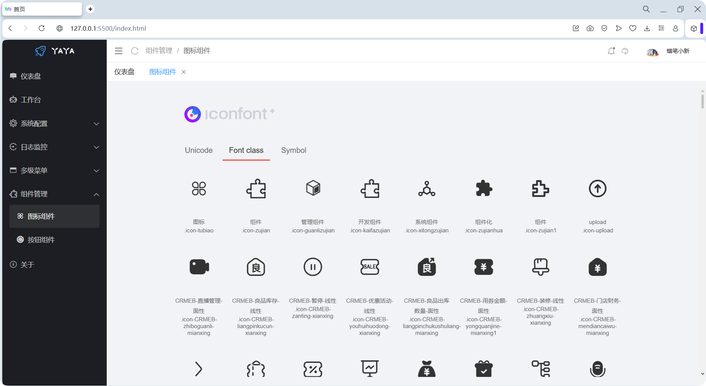
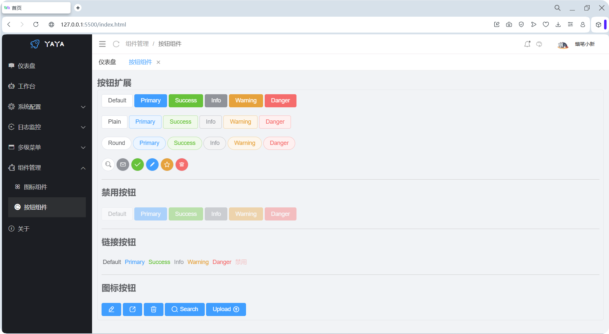
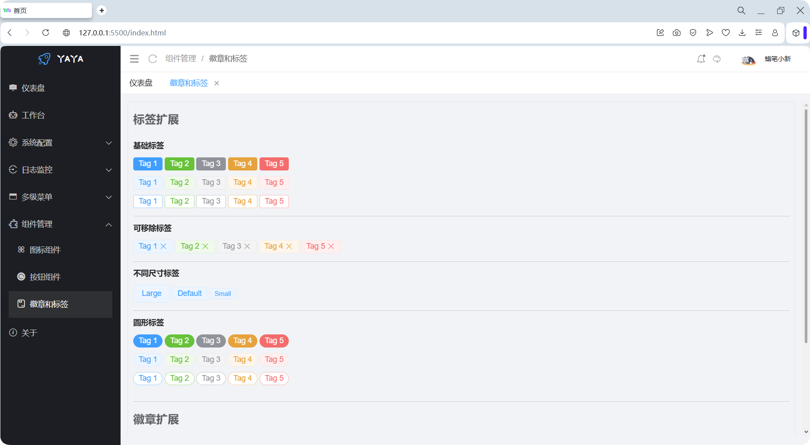
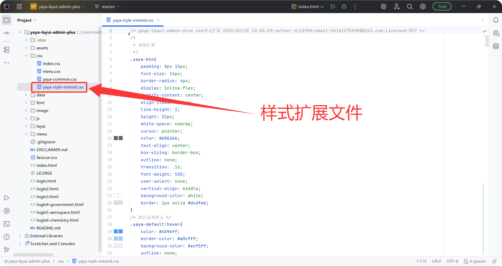
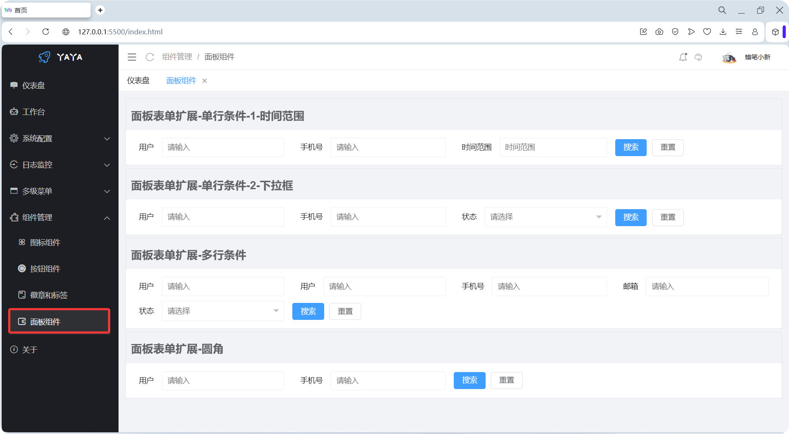
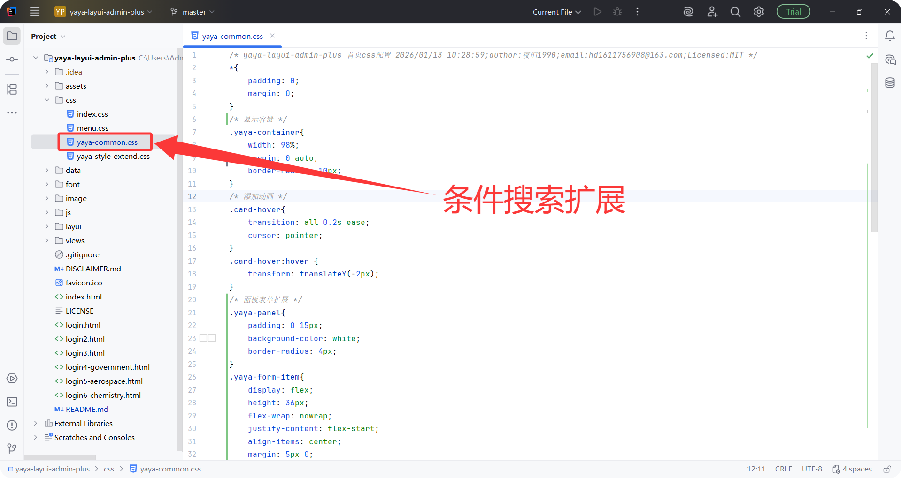
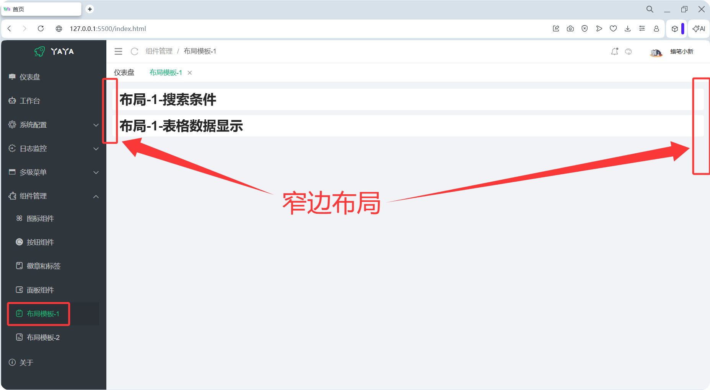
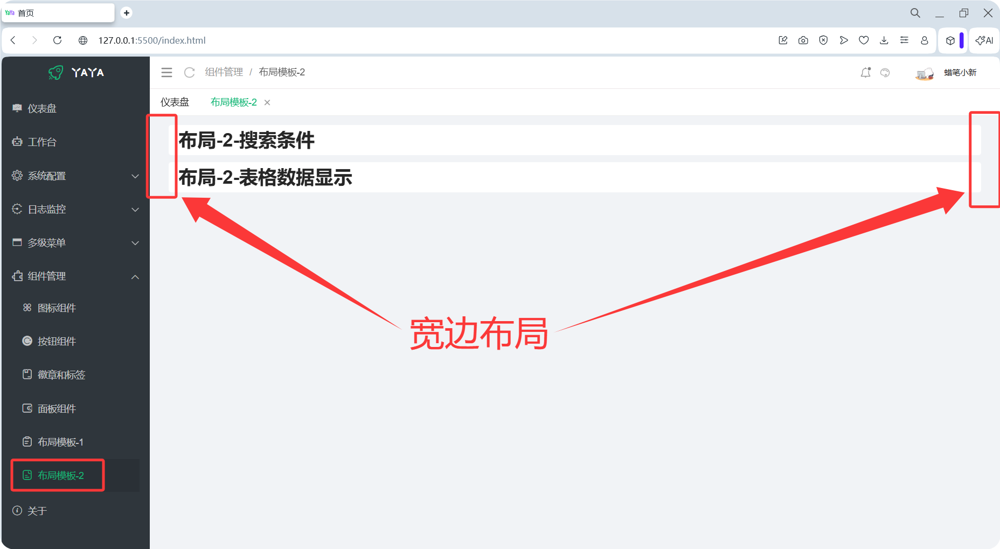

<div align="center">
    
</div>

---

# <div align="center">YaYa-Layui-Admin-Plus</div>
#### <div align="center"> 基于前端框架Layui2.13+开发的一套极简后台管理模板 </div>
<div align="center">
	<a href="https://gitee.com/ukoko/yaya-layui-admin-plus"></a>
    <a href="https://gitee.com/ukoko/yaya-layui-admin-plus"></a>
	<a href="https://gitee.com/ukoko/yaya-layui-admin-plus"></a>
    <a href="https://gitee.com/ukoko/yaya-layui-admin-plus"></a>
</div>

#### 介绍
`YaYa-Layui-Admin-Plus` 基于 [Layui](https://layui.dev/) 框架实现的一套 <strong>简单</strong>、<strong>方便</strong>、<strong>国产化</strong> 前端管理模板，`Layui`虽然是一套前端`UI`框架，但是作者设计的理念并不是为前端程序员设计，而是为了后端程序员设计，让后端程序员告别繁琐的前端配置，只需要简单的了解`HTML/CSS/JS`在加上`Layui`官网，就可以快速开发出属于自己的系统,`Layui`的`UI`组件没有那么丰富多彩，但是他的交互方式简单方便，结合后端程序可以快速建站。

#### 设计初衷

```
1. 作为一个后端开发，对前端生态的抓狂，需要一款简单一看就会的前端技术栈来降低前端的学习、开发和维护成本(特别是时间成本)
2. 只针对电脑端(PC端)用户使用，不需要做移动端的兼容
3. 抛弃目前主流的脚手架项目生成和构建方式，使用纯原生的方式进行开发(技术栈:html/css/js(JQuery))
4. 重点就是这个模板要足够的简单，学习成本要足够的低，并且就算10年以后，来一个新手看这个项目的时候他的学习和使用成本也要足够低
5. 为像我一样的小众群体(记不住Vue那套前端生态，但是还不得不进行前端开发和维护)提供一个新的技术解决方案
6. 为中小型企业提供一套可以低成本开发和维护的前端技术解决方案
7. 为一些人才紧缺的城市提供一套技术栈足够简单的前端技术解决方案
```

#### 更新日志

```
2026-02-27      新增列表条件搜索组件
2026-02-26      新增标签和徽章组件样式
2026-02-25      新增组件管理菜单项[内部新增按钮管理和图标管理]
2026-02-06      README.md添加【模板使用】部分
2026-02-04      首页的图表显示比较丑,换个一个小清新图表
2026-02-03      对核心配置文件中的首页和个人中心页面进行封装,方便用户在第一个使用时对模板进行定制化配置
2026-02-02      首页点击菜单或者选项卡后,选项卡+面包屑+内容显示添加动画效果
2026-01-29      第一个正式版v1.0发布
2026-01-12      零帧起手
```

#### 在线预览

```angular17html
地址        : http://106.14.27.178/
用户名密码   : 随便填(没有后台只有前端样式)
```

#### 模板预览

<table>
    <tr> <td style="width:50%;">  </td><td style="width:50%;"></td></tr>
    <tr> <td style="width:50%;">  </td><td style="width:50%;"></td></tr>
    <tr> <td style="width:50%;">  </td><td style="width:50%;"></td></tr>
    <tr> <td style="width:50%;">  </td><td style="width:50%;"></td></tr>
    <tr> <td style="width:50%;">  </td><td style="width:50%;">  </td></tr>
    <tr> <td style="width:50%;">  </td><td style="width:50%;">  </td></tr>
    <tr> <td style="width:50%;">  </td><td style="width:50%;">  </td></tr>
    <tr> <td style="width:50%;">  </td><td style="width:50%;">  </td></tr>
    <tr> <td style="width:50%;">  </td><td style="width:50%;">  </td></tr>
    <tr> <td style="width:50%;">  </td><td style="width:50%;">  </td></tr>
    <tr> <td style="width:50%;">  </td><td style="width:50%;">  </td></tr>
    <tr> <td style="width:50%;">  </td><td style="width:50%;">  </td></tr>
    <tr> <td style="width:50%;">  </td><td style="width:50%;">  </td></tr>
    <tr> <td style="width:50%;">  </td><td style="width:50%;">  </td></tr>
    <tr> <td style="width:50%;">  </td><td style="width:50%;">  </td></tr>
</table>

#### 项目下载和配置

1.  代码克隆
```
Gitee : git clone https://gitee.com/ukoko/yaya-layui-admin-plus.git
或者
Github: git clone https://github.com/hs-an-yue/yaya-layui-admin-plus.git
```
2.  开发工具选择
```
开发工具建议选择 vscode 为什么呢? ↓↓↓↓↓↓↓↓↓↓↓↓ 请看下面 ↓↓↓↓↓↓↓↓↓↓↓↓
```
3.  开发工具配置(可选)
```
如果不需要进行前后端联调，这个步骤省略。
在进行前端+后端开发联调时很容易出现跨域问题,使用vscode开发工具可以很方便的解决跨域，解决方式如下:
```
```
1. 首先使用vscode进行原生(html/css/js)前端项目运行时，一般使用vscode中的Live Server插件，此插件不仅可以运行前端应用，还可以解决跨域。
2. 解决跨域的步骤如下:
    第1步 在项目的根目录下创建一个 .vscode 文件夹(不要忘记点)
    第2步 在.vscode文件夹中创建一个settings.json文件
    第3步 在settings.json文件中设置以下内容
        {
          "liveServer.settings.port": 5500, //当前HTTP服务器启动的默认端口号,可以自定义设置,不要冲突即可
          "liveServer.settings.proxy": {
            "enable": true, //开启代理
            "baseUri": "/api", //前端代理(使用此地址代替后端服务器地址),名字自定义
            "proxyUri": "http://127.0.0.1:8080" //服务器地址,修改成服务器端的真实地址即可
          }
        }
这样就解决了跨域的问题,当前这只是方便在开发的时候进行测试和联调.在生产环境,配置nginx即可,这里不做nginx介绍.
3. 配置预览    
```
<table>
    <tr> <td>  </td></tr>
</table>

#### 项目结构
```
yaya-layui-admin-plus
├── assets                          # Gitee或者Github上README.md文件中显示的图片
├── css                             # yaya-layui-admin-plus模板的核心css文件
├────── index.css                   # index.html首页的核心css
├────── menu.css                    # index.html首页中左侧导航区域(菜单+LOGO+TITLE)的核心css
├────── yaya-common.css             # 整个模板中大部分页面需要用到的公共css配置在这里(这个属于个人喜好)
├────── yaya-style-extend.css       # yaya-layui-admin-plus模板扩展样式(按钮扩展+图标扩展等)
├── data                            # yaya-layui-admin-plus模板中的测试数据(例如左侧菜单生成数据,用户测试数据,部门测试数据等)
├── image                           # yaya-layui-admin-plus模板中用到的图片(登陆页面的背景图、网站用到的图标等)
├── js                              # yaya-layui-admin-plus模板中的核心JS文件
├────── yaya-admin-plus.js          # yaya-layui-admin-plus模板的核心JS文件(包含整个模板的核心功能的核心函数,例如 左侧菜单实现、选项卡实现等)
├────── xm-select.js                # 多功能下拉框库(第三方库)
├────── echarts.min.js              # 图表库(第三方库)
├── layui                           # Layui核心库
├── views                           # yaya-layui-admin-plus模板中提供的一些案例页面(不喜欢可以全部删掉,用户自己重新添加)
├────── about.html	                # 关于我页
├────── bulletin-board.html         # 公告通知页(内容由模型生成)
├────── badge-tag-extend.html       # 徽章和标签扩展样式页
├────── button-extend.html          # 按钮扩展样式页
├────── iconfont-extend.html        # 字体图标扩展样式页
├────── panel-extend.html           # 面板条件搜索扩展样式页
├────── dashboard.html		        # 仪表盘页(首页)
├────── dept-list.html		        # 部门页(内容由模型生成)
├────── login-log.html		        # 登陆日志页(内容由模型生成)
├────── personal-center.html	    # 个人中心页
├────── pwd-change.html		        # 修改密码页
├────── system-log.html		        # 系统日志页(内容由模型生成)
├────── template.html		        # 模板页(复制整个页面生成新的页面，比较快，没什么实际意义)
├────── test1.html		            # 多级测试页1 - 内容由模型生成 - 其它前端技术(BootStrap5)应用页
├────── test2.html		            # 多级测试页2 - 内容由模型生成 - 其它前端技术(Element Plus)应用页
├────── test3.html		            # 多级测试页3 - 内容由模型生成 - 其它前端技术(Naive UI)应用页
├────── test4.html		            # 多级测试页4 - 内容由模型生成 - 其它前端技术(View UI Plus)应用页
├────── user-list.html		        # 用户页
├────── workbench.html		        # 工作台页
├── .gitignore                      # Git配置文件,用于版本控制管理
├── DISCLAIMER.md                   # 开源软件的免责声明文件
├── favicon.ico                     # yaya-layui-admin-plus模板在预览时,浏览器选项卡上显示的图标
├── index.html                      # yaya-layui-admin-plus模板首页
├── LICENSE                         # 开源软件的开源协议(MIT协议)
├── login.html		                # 登录页1
├── login2.html			            # 登录页2
├── login3.html			            # 登录页3
├── login4-government.html	        # 登录页4(模型生成)
├── login5-aerospace.html	        # 登录页5(模型生成)
├── login6-chemistry.html	        # 登录页6(模型生成)
├── README.md                       # yaya-layui-admin-plus模板的介绍文件

```
#### 项目运行
```
双击项目中的index.html页面,右键按照下面图示进行项目启动
```

<table>
    <tr> <td>  </td></tr>
</table>

#### YaYa模板的成神之路

* [01-YaYa-Layui-Admin-Plus 概述](https://hs-an-yue.github.io/2026/02/26/yaya/01-YaYa-Layui-Admin-Plus%E6%A6%82%E8%BF%B0/#more)
* [02-YaYa-Layui-Admin-Plus 基础配置](https://hs-an-yue.github.io/2026/02/26/yaya/02-YaYa-Layui-Admin-Plus%E5%9F%BA%E7%A1%80%E9%85%8D%E7%BD%AE/#more)

#### 🚀 参与贡献
```
一个人+AI: 产品、开发、文档撰写、推广、后期维护...

联系邮箱: hd1611756908@163.com
```
#### 💖 致谢

感谢 [Layui](https://layui.dev)、[Echarts](https://echarts.apache.org/)、[xm-select](https://xm-select.com/file/xm-select/v1.2.4/#/component/install)、[Vue](https://vuejs.org/)、[BootStrap5](https://getbootstrap.com/)、[Element Plus](https://element-plus.org/)、[Naive UI](https://www.naiveui.com/)、[View UI Plus](https://www.iviewui.com/) 等前端跨框架支持;以及 [Gemini](https://gemini.google.com/app)、[Grok](https://grok.com/)、[Qwen](https://www.qianwen.com/chat)、[豆包](https://www.doubao.com/chat/) 等模型的支持。
