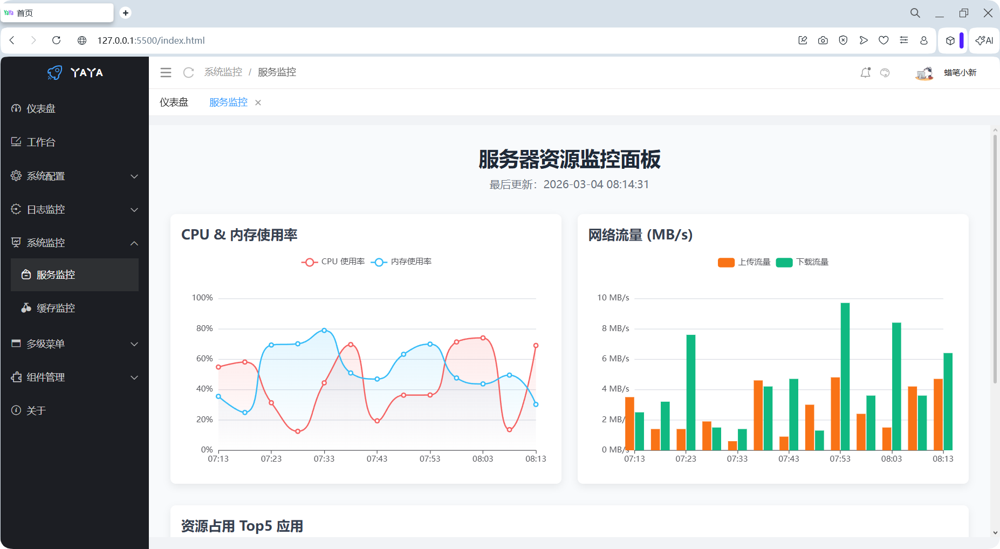
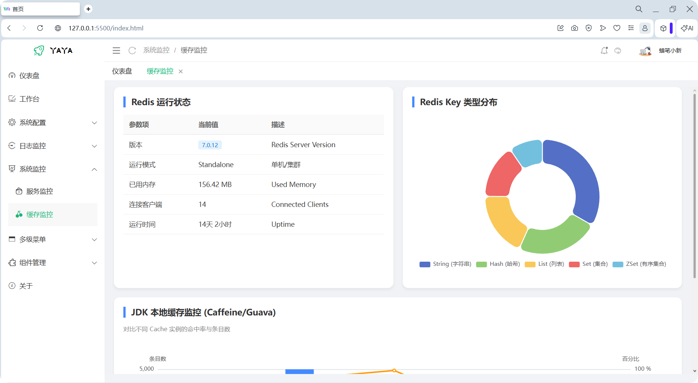

<div align="center">
    
</div>

#### <div align="center"> 基于Layui2.13+实现的一套极简前端管理模板 </div>
<div align="center">
	<a href="https://gitee.com/ukoko/yaya-layui-admin-plus"></a>
    <a href="https://gitee.com/ukoko/yaya-layui-admin-plus"></a>
	<a href="https://gitee.com/ukoko/yaya-layui-admin-plus"></a>
    <a href="https://gitee.com/ukoko/yaya-layui-admin-plus"></a>
</div>

#### 介绍
`YaYa-Layui-Admin-Plus`是一套基于[LayUI](https://layui.dev/)实现的前端管理模板，

#### 设计初衷
```
1. 降低开发成本: 程序员只需要会简单的HTML/CSS/JS即可快速上手开发,开发成本极低,对应的学习成本也极低.
2. 降低维护成本: 简单的技术栈对应着较低的维护成本(人员招聘成本,技术学习时间成本等)

🌟 需要一套简单的技术栈,让公司在岗位招聘的时候可以有更多灵活的选择,项目支撑很多年后依然充满活力. 🚀
```
#### 在线预览

```
预览地址 : http://106.14.27.178/
账号密码 : root/123456
```

#### 更新日志

```
2026-08-19      升级Layui版本库到v2.13.9,修复iframe嵌入的页面滚动条不能到浏览器底部的问题 🆕
2026-04-06      左侧菜单选中样式优化,顶部选项卡样式优化,主题优化,Layui库升级,其它样式优化 🆕🚀🎉✈️
2026-03-04      新增系统监控页面,优化其它样式,发布v2.0-stable版本 🆕🚀🎉💪
2026-02-28      新增布局组件，修改案例页面的样式为模板定义的样式，并且优化了几个不合理的样式，首页统计样式调整
2026-02-27      新增列表条件搜索组件
2026-02-26      新增标签和徽章组件样式
2026-02-25      新增组件管理菜单项[内部新增按钮管理和图标管理]
2026-02-06      README.md添加【模板使用】部分
2026-02-04      首页的图表显示比较丑,换个一个小清新图表
2026-02-03      对核心配置文件中的首页和个人中心页面进行封装,方便用户在第一个使用时对模板进行定制化配置
2026-02-02      首页点击菜单或者选项卡后,选项卡+面包屑+内容显示添加动画效果
2026-01-29      第一个正式版v1.0发布
2026-01-12      零帧起手
```


#### 模板预览

<table>
    <tr> <td style="width:50%;">  </td><td style="width:50%;"></td></tr>
    <tr> <td style="width:50%;">  </td><td style="width:50%;"></td></tr>
    <tr> <td style="width:50%;">  </td><td style="width:50%;">  </td></tr>
    <tr> <td style="width:50%;">  </td><td style="width:50%;">  </td></tr>
</table>

#### 项目下载和配置

1. 代码克隆
```
Gitee : git clone https://gitee.com/ukoko/yaya-layui-admin-plus.git
或者
Github: git clone https://github.com/hs-an-yue/yaya-layui-admin-plus.git
```
2. 开发工具选择
```
开发工具建议选择 vscode 为什么呢? ↓↓↓↓↓↓↓↓↓↓↓↓ 请看下面 ↓↓↓↓↓↓↓↓↓↓↓↓
```
3. 开发工具配置(可选)
```
如果不需要进行前后端联调，这个步骤省略。
在进行前端+后端开发联调时很容易出现跨域问题,使用vscode开发工具可以很方便的解决跨域，解决方式如下:
```
```
1. 首先使用vscode进行原生(html/css/js)前端项目运行时，一般使用vscode中的Live Server插件，此插件不仅可以运行前端应用，还可以解决跨域。
2. 解决跨域的步骤如下:
    第1步 在项目的根目录下创建一个 .vscode 文件夹(不要忘记点)
    第2步 在.vscode文件夹中创建一个settings.json文件
    第3步 在settings.json文件中设置以下内容
        {
          "liveServer.settings.port": 5500, //当前HTTP服务器启动的默认端口号,可以自定义设置,不要冲突即可
          "liveServer.settings.proxy": {
            "enable": true, //开启代理
            "baseUri": "/api", //前端代理(使用此地址代替后端服务器地址),名字自定义
            "proxyUri": "http://127.0.0.1:8080" //服务器地址,修改成服务器端的真实地址即可
          }
        }
这样就解决了跨域的问题,当前这只是方便在开发的时候进行测试和联调.在生产环境,配置nginx即可,这里不做nginx介绍.
3. 配置预览    
```
<table>
    <tr> <td>  </td></tr>
</table>

#### 项目结构
```
yaya-layui-admin-plus
├── assets                          # Gitee或者Github上README.md文件中显示的图片
├── css                             # yaya-layui-admin-plus模板的核心css文件
├────── index.css                   # index.html首页的核心css
├────── menu.css                    # index.html首页中左侧导航区域(菜单+LOGO+TITLE)的核心css
├────── yaya-common.css             # 整个模板中大部分页面需要用到的公共css配置在这里(这个属于个人喜好)
├────── yaya-style-extend.css       # yaya-layui-admin-plus模板扩展样式(按钮扩展+图标扩展等)
├── data                            # yaya-layui-admin-plus模板中的测试数据(例如左侧菜单生成数据,用户测试数据,部门测试数据等)
├── image                           # yaya-layui-admin-plus模板中用到的图片(登陆页面的背景图、网站用到的图标等)
├── js                              # yaya-layui-admin-plus模板中的核心JS文件
├────── yaya-admin-plus.js          # yaya-layui-admin-plus模板的核心JS文件(包含整个模板的核心功能的核心函数,例如 左侧菜单实现、选项卡实现等)
├────── xm-select.js                # 多功能下拉框库(第三方库)
├────── echarts.min.js              # 图表库(第三方库)
├── layui                           # Layui核心库
├── views                           # yaya-layui-admin-plus模板中提供的一些案例页面(不喜欢可以全部删掉,用户自己重新添加)
├────── about.html	            # 关于我
├────── bulletin-board.html         # 公告通知页(内容由模型生成)
├────── badge-tag-extend.html       # 徽章和标签扩展样式页
├────── button-extend.html          # 按钮扩展样式页
├────── extend-iconfont.html        # 字体图标扩展样式页
├────── panel-extend.html           # 面板条件搜索扩展样式页
├────── dashboard.html		    # 仪表盘页(首页)
├────── dept-list.html		    # 部门页(内容由模型生成)
├────── personal-center.html	    # 个人中心页
├────── pwd-change.html		    # 修改密码页
├────── template.html		    # 模板页(复制整个页面生成新的页面，比较快，没什么实际意义)
├────── menu1.html		        # 多级测试页1 
├────── menu2.html		        # 多级测试页2
├────── menu3.html		        # 多级测试页3
├────── menu4.html		        # 多级测试页4
├────── user-list.html		    # 用户页
├────── workbench.html		    # 工作台页
├── .gitignore                      # Git配置文件,用于版本控制管理
├── DISCLAIMER.md                   # 开源软件的免责声明文件
├── favicon.ico                     # yaya-layui-admin-plus模板在预览时,浏览器选项卡上显示的图标
├── index.html                      # yaya-layui-admin-plus模板首页
├── LICENSE                         # 开源软件的开源协议(MIT协议)
├── login1.html		            # 登录页1
├── login2-government.html	    # 登录页2(模型生成) 适合政企的登录页
├── README.md                       # yaya-layui-admin-plus模板的介绍文件

```
#### 项目运行
```
双击项目中的index.html页面,右键按照下面图示进行项目启动
```

<table>
    <tr> <td>  </td></tr>
</table>

#### 🚀 参与贡献

> 一人团队  -- 联系邮箱: hd1611756908@163.com

#### 💖 致谢

感谢 [Layui](https://layui.dev)、[Echarts](https://echarts.apache.org/)、[xm-select](https://xm-select.com/file/xm-select/v1.2.4/#/component/install)、[Vue](https://vuejs.org/)、[BootStrap5](https://getbootstrap.com/)、[Element Plus](https://element-plus.org/)、[Naive UI](https://www.naiveui.com/)、[View UI Plus](https://www.iviewui.com/) 等前端跨框架支持;以及 [Gemini](https://gemini.google.com/app)、[Grok](https://grok.com/)、[Qwen](https://www.qianwen.com/chat)、[豆包](https://www.doubao.com/chat/) 等模型的支持。
