<div align="center">
    
</div>

### <div align="center"> 基于Layui2.13+实现的一套极简前端管理模板 </div>
<div align="center">
	<a href="https://gitee.com/ukoko/yaya-layui-admin-plus"></a>
    <a href="https://gitee.com/ukoko/yaya-layui-admin-plus"></a>
	<a href="https://gitee.com/ukoko/yaya-layui-admin-plus"></a>
    <a href="https://gitee.com/ukoko/yaya-layui-admin-plus"></a>
</div>

## 介绍
`YaYa-Layui-Admin-Plus`是一套基于[LayUI](https://layui.dev/)实现的前端管理模板，项目采用原始单页独立的构建方式，不依赖脚手架，开发者只需要掌握简单的HTML/CSS/JS基础知识即可快速上手，开发和维护成本极低。

## 设计初衷

> 🌟 需要一套最简单的技术栈，来降低前端的学习、开发和维护成本。

## 在线预览

```
预览地址 : http://106.14.27.178/
账号密码 : root/123456
```

## 学习路线

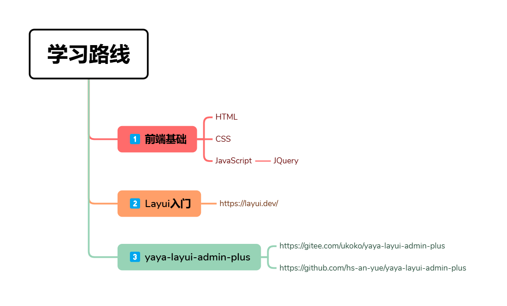

## 页面预览

<table>
    <tr> <td style="width:50%;">  </td><td style="width:50%;"></td></tr>
    <tr> <td style="width:50%;"> 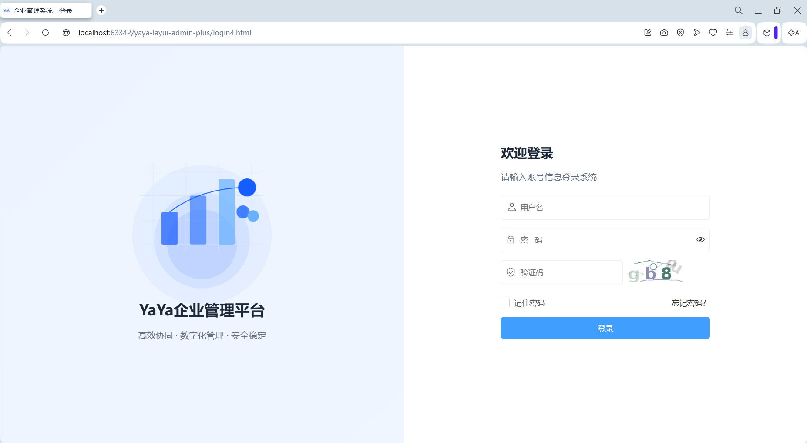 </td><td style="width:50%;">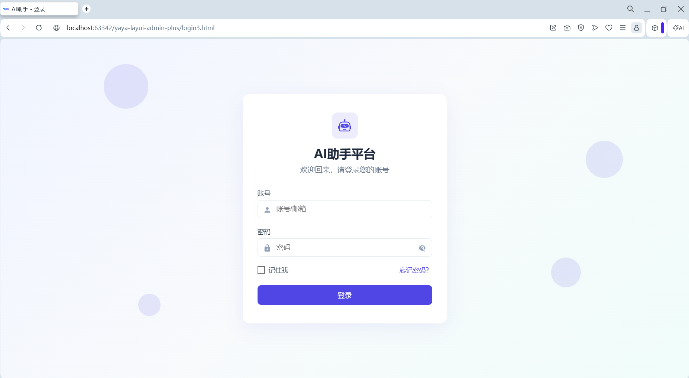</td></tr>
    <tr> <td style="width:50%;"> 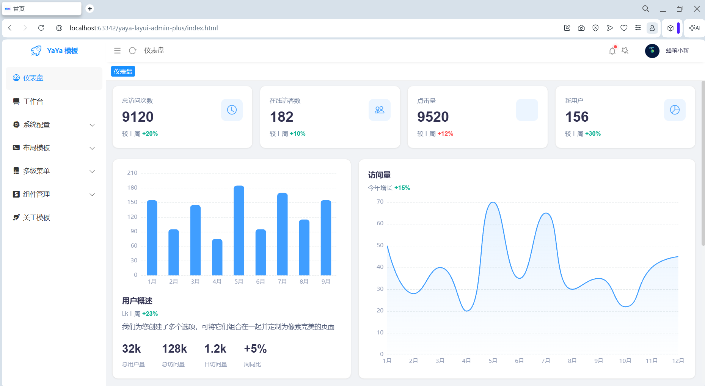 </td><td style="width:50%;">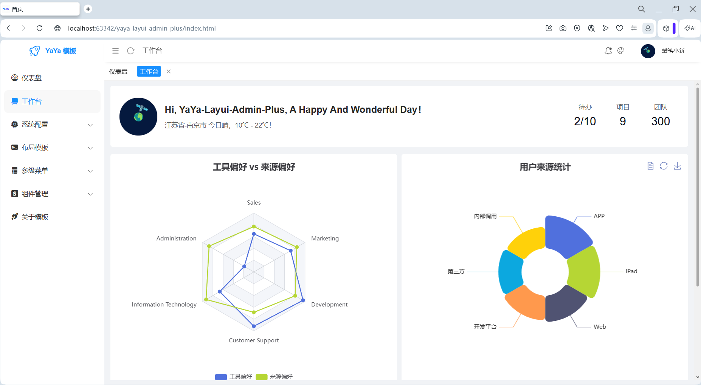</td></tr>
    <tr> <td style="width:50%;">  </td><td style="width:50%;">  </td></tr>
    <tr> <td style="width:50%;"> 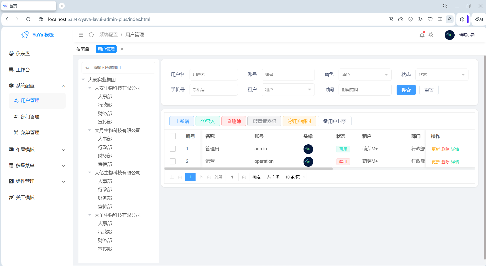 </td><td style="width:50%;"> 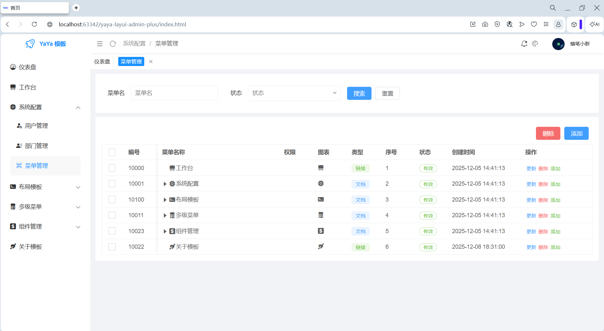 </td></tr>
    <tr> <td style="width:50%;"> 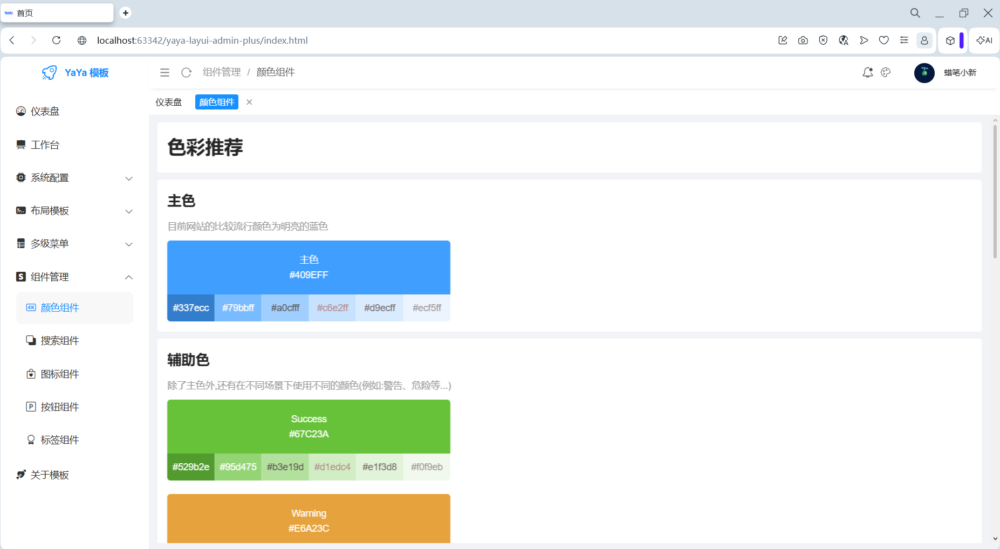 </td><td style="width:50%;"> 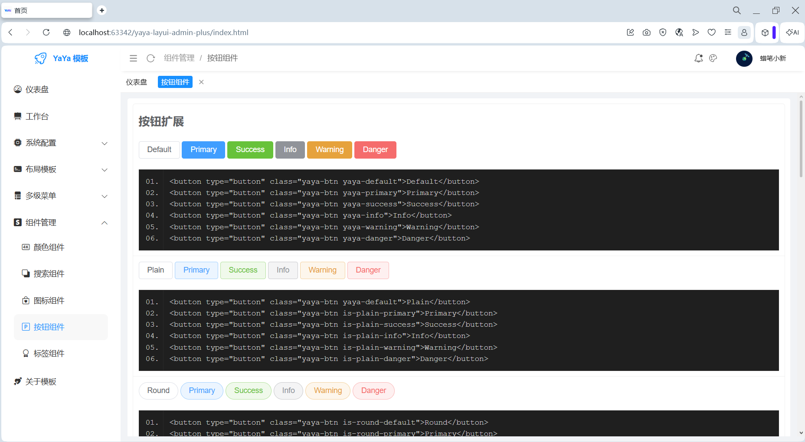 </td></tr>
    <tr> <td style="width:50%;"> 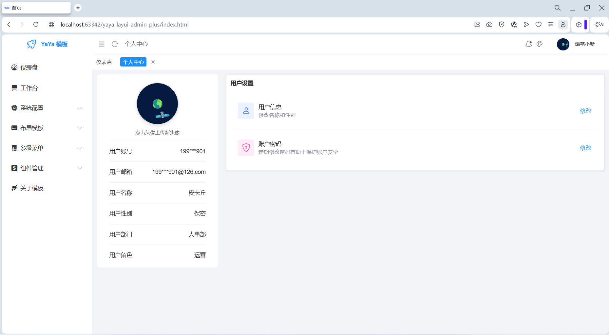 </td><td style="width:50%;"> 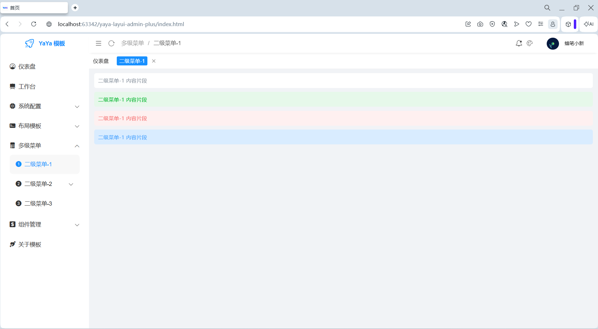 </td></tr>
</table>

## 项目结构
```
yaya-layui-admin-plus
├── assets                                  # README.md文件中显示的图片
├── css                                     # 核心css文件
├────── index.css                               # index.html首页css样式配置文件
├────── menu.css                                # index.html页面左侧菜单栏的css样式配置文件
├────── yaya-common.css                         # 为YaYa模板布局提供了一些常见样式，布局容器、比如容器鼠标移入添加动画、布局面板等
├────── yaya-style-extend.css                   # 为YaYa模板提供了一些扩展样式，例如按钮扩展、标签徽章扩展等
├── data                                    # 模拟数据
├── font                                    # 字体图标库,目前引入的为bootstrap官方图标库
├── image                                   # 图片(图标、LOGO等)
├── js                                      # 核心JS文件
├────── yaya-admin-plus.js                      # YaYa模板核心文件,包含菜单生成、选项卡操作、面包屑功能等
├────── xm-select.js                            # 多功能下拉框库(第三方库)
├────── echarts.min.js                          # 图表库(第三方库)
├── layui                                   # Layui核心库
├── views                                   # DEMO页面
├────── dashboard.html	                        # 仪表盘页
├────── dept-add.html	                        # 部门添加
├────── dept-list.html	                        # 部门列表
├────── extend-about.html	                # 关于我
├────── extend-badge.html                       # 徽章和标签扩展
├────── extend-button.html                      # 按钮扩展
├────── extend-color.html                       # 颜色推荐
├────── extend-iconfont.html                    # 字体图标扩展
├────── extend-layout-1.html                    # 布局1(紧凑)
├────── extend-layout-1-demo.html               # 布局样例(紧凑)
├────── extend-layout-2.html                    # 布局2(舒缓)
├────── extend-layout-2-demo.html               # 布局样例(舒缓)
├────── extend-search.html                      # 条件搜索扩展
├────── menu-list.html                          # 菜单树形列表
├────── notice-detail.html	                # 消息详情
├────── notice-list.html	                # 消息列表
├────── personal-center.html	                # 个人中心页
├────── personal-center-password-edit.html	# 个人中心修改密码
├────── personal-center-user-edit.html		# 个人中心修改用户
├────── tree-menu1.html		                # 多级菜单1
├────── tree-menu2.html		                # 多级菜单2
├────── tree-menu3.html		                # 多级菜单3
├────── tree-menu4.html		                # 多级菜单4
├────── user-add.html		                # 用户添加
├────── user-import.html		        # 用户导入
├────── user-list.html		                # 用户列表
├────── workbench.html		                # 工作台
├── .gitignore                              # git版本忽略文件
├── DISCLAIMER.md                           # 开源软件的免责声明文件
├── favicon.ico                             # 浏览器选项卡上显示的图标
├── index.html                              # 项目首页
├── LICENSE                                 # 开源协议
├── login1.html		                    # 登录页1
├── login2-government.html	            # 登录页2-政企的登录页
├── login3.html	                            # 登录页3-知识库登录页
├── login4.html	                            # 登录页4-B端登录页面
├── README.md                               # 介绍文件
```

## 快速使用

[YaYa-Layui-Admin-Plus 快速使用](https://hs-an-yue.github.io/2026/08/23/yaya/yaya-layui-admin-plus%E5%BF%AB%E9%80%9F%E5%85%A5%E9%97%A8/#more)

## 🚀 联系邮箱

>  联系邮箱: hd1611756908@163.com
